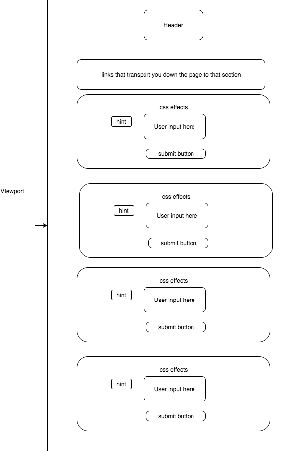

## CSS-athon

### Background

CSS can be very challenging to learn and implement. However, the power of CSS to transform a website into something very visually appealing, makes learning CSS a must for any software developer. CSS-athon provides a tutorial for learning cool CSS functions that allow for dynamic user-friendly interactions that when implemented correctly, can make any website truly awesome.

### Functionality & MVP

The CSS-athon will be able to:

-  Show users the CSS feature in action when hovering over the item
-  User will be able to input their own CSS code to see if it matches the correct CSS code for the function
-  Show/Hide hints and the final, correct CSS code behind the CSS feature upon correct user code input
-  Several CSS effects will be highlighted with a preference towards the more advanced CSS topics such as pseudo-classes, transforms, transitions, and animations

### Additional Attributes
-  A production Readme

### Wireframes

### Architecture and Technologies

This project will be implemented with the following technologies:

- Vanilla JavaScript and `jquery` for overall structure and logic,
- `HTML5` and `CSS3` for all for DOM manipulation and rendering,
- Webpack to bundle and serve up the various scripts.

### Implementation Timeline

**Day 1**: Setup all necessary Node modules, including getting webpack up and running.  Create `webpack.config.js` as well as `package.json`.  Write a basic entry file and the skeleton for all 3 scripts outlined above. Start collecting the CSS code for the CSS features.

**Day 2**: Finish collecting all the CSS code for the CSS features. Build the user interface out with the CSS functions and the forms that user will type their CSS into on the frontend.

**Day 3**: Build out the backside of the program. Create the tutorials so that when a user types, the backend checks to see if their code is correct. Adding a hints button and a submit button. When the user submits a correct answer it will do something cool and activate the CSS feature. (not sure what, still brainstorming, open to ideas.) When the user submits an incorrect answer it will also do something cool and prompt for a hint. (again, not sure what, still brainstorming, open to ideas.) 

**Day 4**: Style the frontend, making it polished and professional. Make sure everything works.

### Bonus feature

Add a more detailed step by step tutorial building on the current functionality.
Add tests with automation.
